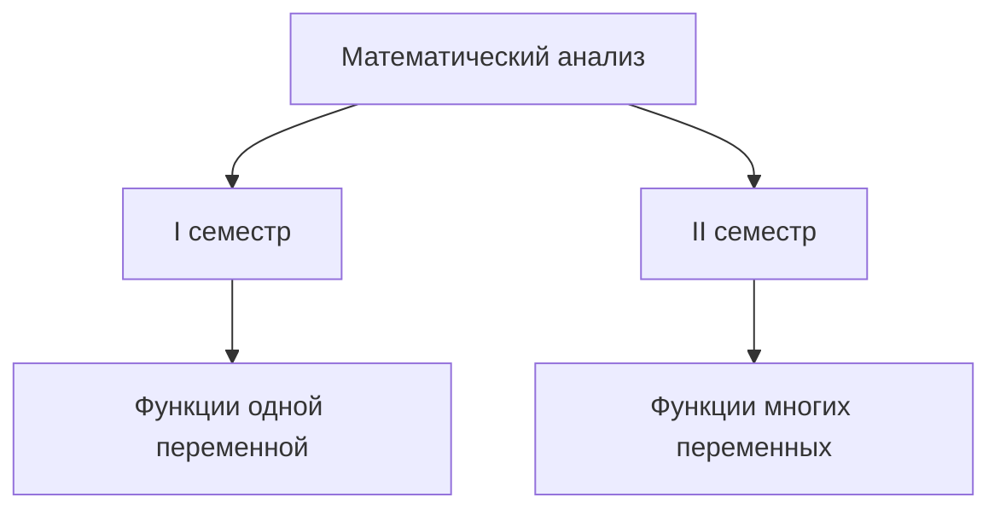

## §1. Обзор курса

Идея. Математический анализ изучает функции, заданные на множестве.

Объект изучения: Функции.
- R — независимый аргумент.
- Функция обозначается буквой F.

Структура курса:

## §2. Вещественные числа

Рациональное число — можно представить как m/n, где m целое, n натуральное.

Недостаток. Рациональных чисел недостаточно: sqrt(2) не является рациональным.
